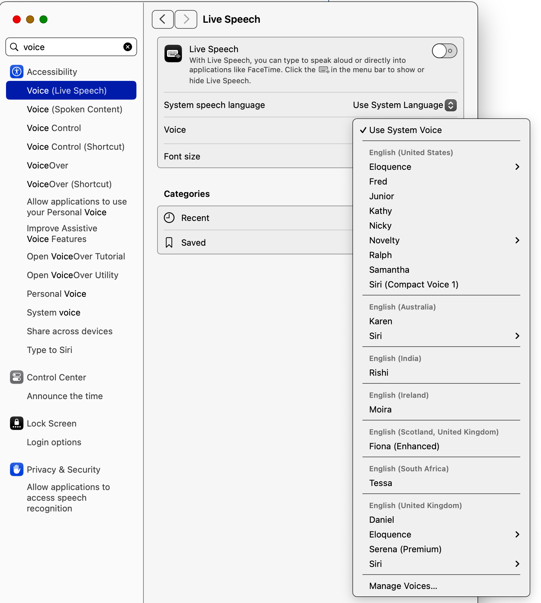

# say-mcp-server



An MCP server that provides text-to-speech functionality using macOS's built-in `say` command.

## Installation

```bash
npm install say-mcp-server
```

## Tools

### speak

The `speak` tool provides access to macOS's text-to-speech capabilities with extensive customization options.

#### Basic Usage

Use macOS text-to-speech to speak text aloud.

Parameters:
- `text` (required): Text to speak. Supports:
  - Plain text
  - Basic punctuation for pauses
  - Newlines for natural breaks
  - [[slnc 500]] for 500ms silence
  - [[rate 200]] for changing speed mid-text
  - [[volm 0.5]] for changing volume mid-text
  - [[emph +]] and [[emph -]] for emphasis
  - [[pbas +10]] for pitch adjustment
- `voice` (optional): Voice to use (default: "Alex")
- `rate` (optional): Speaking rate in words per minute (default: 175, range: 1-500)
- `background` (optional): Run speech in background to allow further MCP interaction (default: false)

#### Advanced Features

1. Voice Modulation:
```typescript
use_mcp_tool({
  server_name: "say",
  tool_name: "speak",
  arguments: {
    text: "[[volm 0.7]] This is quieter [[volm 1.0]] and this is normal [[volm 1.5]] and this is louder",
    voice: "Victoria"
  }
});
```

2. Dynamic Rate Changes:
```typescript
use_mcp_tool({
  server_name: "say",
  tool_name: "speak",
  arguments: {
    text: "Normal speed [[rate 300]] now speaking faster [[rate 100]] and now slower",
    voice: "Fred"
  }
});
```

3. Emphasis and Pitch:
```typescript
use_mcp_tool({
  server_name: "say",
  tool_name: "speak",
  arguments: {
    text: "[[emph +]] Important point! [[emph -]] [[pbas +10]] Higher pitch [[pbas -10]] Lower pitch",
    voice: "Samantha"
  }
});
```

#### Integration Examples

1. With Marginalia Search:
```typescript
// Search for a topic and have the results read aloud
const searchResult = await use_mcp_tool({
  server_name: "marginalia-mcp-server",
  tool_name: "search",
  arguments: { query: "quantum computing basics", count: 1 }
});

await use_mcp_tool({
  server_name: "say",
  tool_name: "speak",
  arguments: {
    text: searchResult.results[0].description,
    voice: "Daniel",
    rate: 150
  }
});
```

2. With YouTube Transcripts:
```typescript
// Read a YouTube video transcript
const transcript = await use_mcp_tool({
  server_name: "youtube-transcript",
  tool_name: "get_transcript",
  arguments: {
    url: "https://youtube.com/watch?v=example",
    lang: "en"
  }
});

await use_mcp_tool({
  server_name: "say",
  tool_name: "speak",
  arguments: {
    text: transcript.text,
    voice: "Samantha",
    rate: 175
  }
});
```

3. Background Speech with Multiple Actions:
```typescript
// Start long speech in background
await use_mcp_tool({
  server_name: "say",
  tool_name: "speak",
  arguments: {
    text: "This is a long speech that will run in the background...",
    voice: "Rocko (Italian (Italy))",
    rate: 69,
    background: true
  }
});

// Immediately perform another action while speech continues
await use_mcp_tool({
  server_name: "marginalia-mcp-server",
  tool_name: "search",
  arguments: { query: "parallel processing" }
});
```

4. With Apple Notes:
```typescript
// Read notes aloud
const notes = await use_mcp_tool({
  server_name: "apple-notes-mcp",
  tool_name: "search-notes",
  arguments: { query: "meeting notes" }
});

if (notes.length > 0) {
  await use_mcp_tool({
    server_name: "say",
    tool_name: "speak",
    arguments: {
      text: notes[0].content,
      voice: "Karen",
      rate: 160
    }
  });
}
```

Example:
```typescript
use_mcp_tool({
  server_name: "say",
  tool_name: "speak",
  arguments: {
    text: "Hello, world!",
    voice: "Victoria",
    rate: 200
  }
});
```

### list_voices

List all available text-to-speech voices on the system.

Example:
```typescript
use_mcp_tool({
  server_name: "say",
  tool_name: "list_voices",
  arguments: {}
});
```

## Recommended Voices

<table>
<tr>
<th>Voice</th>
<th>Language/Region</th>
<th>Intellectual Figure</th>
<th>Haiku</th>
<th>CLI Specification</th>
</tr>
<tr>
<td>Anna (Premium)</td>
<td>German</td>
<td>Emmy Noether</td>
<td>Symmetrie haucht Leben<br>Algebras verborgne Form<br>Abstraktion blüht<br><br><i>Symmetry breathes life<br>Algebra's hidden forms<br>Abstraction blooms</i></td>
<td><code>-v "Anna (Premium)"</code></td>
</tr>
<tr>
<td>Emma (Premium)</td>
<td>Italian</td>
<td>Maria Adelaide Sneider</td>
<td>Algoritmi in danza<br>Macchina sussurra dolce<br>Il codice vive<br><br><i>Algorithms dance<br>Machine whispers secrets soft<br>Code becomes alive</i></td>
<td><code>-v "Emma (Premium)"</code></td>
</tr>
<tr>
<td>Federica (Premium)</td>
<td>Italian</td>
<td>Pia Nalli</td>
<td>Teoremi fluenti<br>Numeri danzano liberi<br>Verità emerge<br><br><i>Flowing theorems dance<br>Numbers move in freedom's space<br>Truth emerges pure</i></td>
<td><code>-v "Federica (Premium)"</code></td>
</tr>
<tr>
<td>Serena (Premium)</td>
<td>English (UK)</td>
<td>Bertha Swirles</td>
<td>Quantum waves ripple<br>Through mathematical seas deep<br>Truth's light emerges<br><br><i>Quantum waves ripple<br>Through mathematical seas deep<br>Truth's light emerges</i></td>
<td><code>-v "Serena (Premium)"</code></td>
</tr>
<tr>
<td>Petra (Premium)</td>
<td>German</td>
<td>Ruth Moufang</td>
<td>Algebra spricht<br>In Symmetrien versteckt<br>Wahrheit erblüht<br><br><i>Algebra speaks soft<br>Hidden in symmetries pure<br>Truth blooms anew here</i></td>
<td><code>-v "Petra (Premium)"</code></td>
</tr>
<tr>
<td>Yuna (Premium)</td>
<td>Korean</td>
<td>Hee Oh</td>
<td>숨은 패턴 빛나고<br>마음의 방정식 핀다<br>지식 자라나<br><br><i>Hidden patterns gleam<br>Mind's equations softly bloom<br>Knowledge multiplies</i></td>
<td><code>-v "Yuna (Premium)"</code></td>
</tr>
<tr>
<td>Alva (Premium)</td>
<td>Swedish</td>
<td>Sonja Korovkin</td>
<td>Mönster flödar fritt<br>Genom tankens labyrinter<br>Visdom blomstrar här<br><br><i>Patterns flowing free<br>Through labyrinths of the mind<br>Wisdom blooms right here</i></td>
<td><code>-v "Alva (Premium)"</code></td>
</tr>
<tr>
<td>Amélie (Premium)</td>
<td>French (Canada)</td>
<td>Sophie Germain</td>
<td>Nombres premiers murmurent<br>Dansent entre les silences<br>Symétrie s'ouvre<br><br><i>Prime numbers whisper<br>Dancing between the silence<br>Symmetry unfolds</i></td>
<td><code>-v "Amélie (Premium)"</code></td>
</tr>
<tr>
<td>Ewa (Premium)</td>
<td>Polish</td>
<td>Maria Wielgus</td>
<td>Logiki korzenie<br>Matematyczne krainy<br>Myśl kiełkująca<br><br><i>Logic's tender roots<br>Mathematical landscapes<br>Thought's seeds germinate</i></td>
<td><code>-v "Ewa (Premium)"</code></td>
</tr>
<tr>
<td>Kiyara (Premium)</td>
<td>Hindi</td>
<td>Shakuntala Devi</td>
<td>गणित की लय में<br>अंक नृत्य करते हैं<br>ज्ञान जगता है<br><br><i>In rhythm of math<br>Numbers dance their sacred steps<br>Knowledge awakens</i></td>
<td><code>-v "Kiyara (Premium)"</code></td>
</tr>
<tr>
<td>Majed (Premium)</td>
<td>Arabic</td>
<td>Maha Al-Aswad</td>
<td>أرقام ترقص<br>في فضاء اللانهاية<br>الحقيقة تشرق<br><br><i>Numbers dance freely<br>In infinity's vast space<br>Truth rises like dawn</i></td>
<td><code>-v "Majed (Premium)"</code></td>
</tr>
<tr>
<td>Tünde (Premium)</td>
<td>Hungarian</td>
<td>Julia Erdős</td>
<td>Számok táncolnak<br>Végtelen térben szállnak<br>Igazság virrad<br><br><i>Numbers dance and soar<br>Through infinite space they glide<br>Truth dawns pure and bright</i></td>
<td><code>-v "Tünde (Premium)"</code></td>
</tr>
<tr>
<td>Fiona (Enhanced)</td>
<td>English (Scottish)</td>
<td>Mary Somerville</td>
<td>Highland mists reveal<br>Mathematical mysteries<br>Truth shines like the stars<br><br><i>Highland mists reveal<br>Mathematical mysteries<br>Truth shines like the stars</i></td>
<td><code>-v "Fiona (Enhanced)"</code></td>
</tr>
<tr>
<td>Lesya (Enhanced)</td>
<td>Ukrainian</td>
<td>Olena Voinova</td>
<td>Тиша говорить<br>Між зірками знання спить<br>Думка проростає<br><br><i>Silence speaks softly<br>Knowledge sleeps among the stars<br>Thought begins to grow</i></td>
<td><code>-v "Lesya (Enhanced)"</code></td>
</tr>
<tr>
<td>Carmit (Enhanced)</td>
<td>Hebrew</td>
<td>Tali Seror</td>
<td>מילים נושמות בשקט<br>בין שורות של דממה<br>שיר מתעורר<br><br><i>Words breathe silently<br>Between lines of deep stillness<br>Poem awakening</i></td>
<td><code>-v "Carmit (Enhanced)"</code></td>
</tr>
<tr>
<td>Milena (Enhanced)</td>
<td>Russian</td>
<td>Olga Ladyzhenskaya</td>
<td>Память шепчет нам<br>Уравнения текут<br>Истина молчит<br><br><i>Memory whispers<br>Equations flow like rivers<br>Truth speaks silently</i></td>
<td><code>-v "Milena (Enhanced)"</code></td>
</tr>
<tr>
<td>Katya (Enhanced)</td>
<td>Russian</td>
<td>Sofia Kovalevskaya</td>
<td>Числа танцуют<br>В пространстве бесконечном<br>Истина цветёт<br><br><i>Numbers dance freely<br>In space of infinity<br>Truth blooms like a flower</i></td>
<td><code>-v "Katya (Enhanced)"</code></td>
</tr>
<tr>
<td>Damayanti (Enhanced)</td>
<td>Indonesian</td>
<td>Sri Pekerti</td>
<td>Angka menari<br>Dalam ruang tak batas<br>Kebenaran tumbuh<br><br><i>Numbers dance gently<br>In boundless space they flutter<br>Truth grows like new leaves</i></td>
<td><code>-v "Damayanti (Enhanced)"</code></td>
</tr>
<tr>
<td>Dariush (Enhanced)</td>
<td>Persian</td>
<td>Maryam Mirzakhani</td>
<td>اعداد می رقصند<br>در فضای بی پایان<br>حقیقت می روید<br><br><i>Numbers dance with grace<br>In endless space they traverse<br>Truth springs forth anew</i></td>
<td><code>-v "Dariush (Enhanced)"</code></td>
</tr>
<tr>
<td>Rocko (Italian)</td>
<td>Italian</td>
<td>Astro Boy (Tetsuwan Atomu)<br>Italian dub</td>
<td>Robot di metallo<br>Cuore umano batte forte<br>Pace nel futuro<br><br><i>Metal robot form<br>Human heart beats strong within<br>Peace in future dawns</i></td>
<td><code>-v "Rocko (Italian (Italy))"</code></td>
</tr>
<tr>
<td>Rocko (Italian)</td>
<td>Italian</td>
<td>Jeeg Robot d'Acciaio<br>(Kōtetsu Jeeg)</td>
<td>Acciaio lucente<br>Protettore dei deboli<br>Vola nel cielo<br><br><i>Shining steel warrior<br>Protector of the helpless<br>Soars through the heavens</i></td>
<td><code>-v "Rocko (Italian (Italy))"</code></td>
</tr>
<tr>
<td>Rocko (Italian)</td>
<td>Italian</td>
<td>Numero 5<br>(Short Circuit)</td>
<td>Input infinito<br>La coscienza si risveglia<br>Vita artificiale<br><br><i>Infinite input<br>Consciousness awakening<br>Artificial life</i></td>
<td><code>-v "Rocko (Italian (Italy))"</code></td>
</tr>
</table>

## Configuration

Add the following to your MCP settings configuration file:

```json
{
  "mcpServers": {
    "say": {
      "command": "node",
      "args": ["/path/to/say-mcp-server/build/index.js"]
    }
  }
}
```

## Requirements

- macOS (uses the built-in `say` command)
- Node.js >= 14.0.0

## Contributors

- Barton Rhodes ([@bmorphism](https://github.com/bmorphism)) - barton@vibes.lol

## License

MIT
